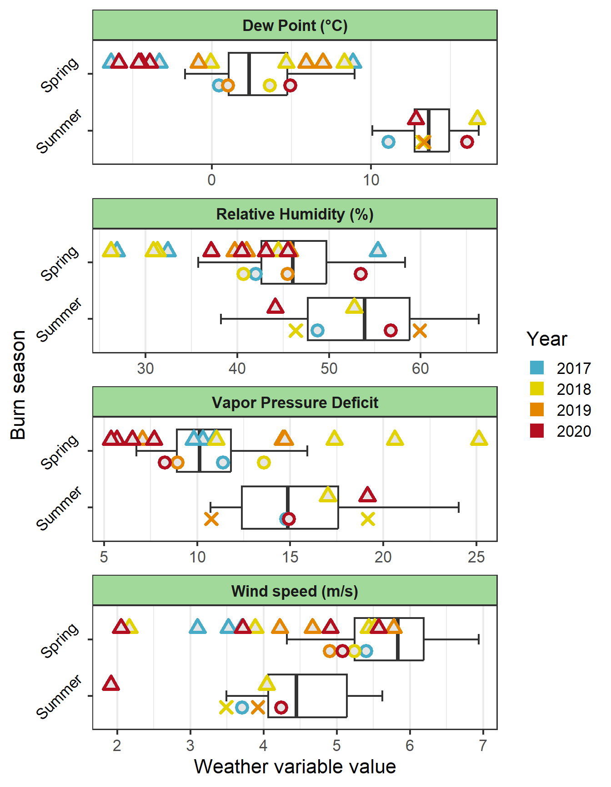

**Author contributions:** Conception, analysis, writing: DAM; Programming and editing: JPA

\newpage 
# Abstract

There is growing interest in diversifying human-managed fire regimes. 
In many North American grasslands, late growing season burns re-introduce fire to periods most prone to lightning-driven fire prior to wildfire suppression policies. 
We report here on restoring summer fire in central North Dakota, USA, from a research project in which summer fire was only successfully achieved in two out of four years. 
We use remotely-sensed imagery and local weather data to assess whether fuel or weather conditions limited burning in the summer, and to compare fire environmental conditions and subsequent burn severity across prescribed burns conducted in the spring and summer. 
Finally, we review historical data to determine if conditions have changed in either the spring or summer burn seasons over 42 years. 
We found that burn severity declined with fuelbed greenness but was independent of burn season---summer burns could effect as high of severity as spring burns despite having greener fuelbeds.
What little phenological change seems to have occurred at the study location---slightly greener fuelbeds and slightly lower relative humidity in spring---likely offset each other to some degree. 
Overall, we found little evidence that successful summer burns were anomalies, and conclude that it is reasonable for managers to incorporate late growing season fire into prescribed fire programs with the caveat that some summers will simply be too wet and/or too green to burn.

**Keywords:** Burn severity; Phenology; Seasonality of fire; Pyrodiversity

# Implications for practice 

* Successful Rx fire in the summer is likely the norm, not the exception. 
* At least at this specific research station, there is little evidence that fuel and weather conditions have changed over 42 years except for slightly greener spring fuels and lower relative humidity, which might cancel each other out. 

# Introduction 

Fire is essential to the maintenance of grasslands and other open ecosystems, and has been described as a key component of restoring pre-colonial ecological conditions [@bond2021; @fuhlendorf2017]. 
The nature of fire in a given ecosystem is described as a regime. 
While determining the vegetation layer(s) that carry fire and the typical frequency and intensity of burning are relatively straightforward, seasonality and ignition source are much more difficult to reconstruct [@mcgranahan2021]. 
As such, the appropriate season(s) in which to burn is among the most debated aspects of fire restoration projects. 

Burning in different seasons can produce different effects. 
While combustion in the wildland fire environment is theoretically possible whenever a competent ignition source is introduced to a sufficient amount of dry vegetation, climate often determines whether these conditions occur simultaneously. 
Lightning is the primary source of natural ignitions responsible for most fire starts prior to the emergence of hominids several hundred thousand years ago [@pyne1994]. 
As humans evolved and their technological capacity increased, so too did the influence of their ignitions.
In regions with extant cultural fire use, the seasonality of fire is often dictated by localized and traditional land-use goals [@mcgranahan2022]. 
In most Western countries, however, cultural burning has been replaced by systematic, command-and-control fire management in which most unplanned ignitions are suppressed and intentional burning occurs under strict prescriptions [e.g., @steen-adams2017]. 

Restoring summer fire is of particular interest among managers in the North American Great Plains, where the influence of Indigenous ignitions was extensive and interacted with climate [@boyd2002; @roos2018]. 
Prescribed fire in the Great Plains has conventionally occurred while vegetation is dormant, although @engle2001 argued prairie was resilient to fire in any season and challenged managers to consider summer burns. 
Although subsequent research has shown benefits of summer fire for diversity and productivity [@ansley2007a; @decker2019], a survey of grassland managers found that summer remains the least frequent season for prescribed fire [@harmon-threatt2016]. 
Meanwhile, wide variability in responses to seasonal fire have been reported within and across plant functional groups, often driven by disproportionately large responses by few species [@steuter1987; @mndela2023; @biondini1989; @sparks1998]. 
Considerable variability in responses to summer fire has been attributed to the fact that higher humidity and fuel moisture during the growing season often reduce fire intensity and effect lower severity [@steuter1987; @tangney2022].

The Northern Great Plains might have had one of the most pronounced differentials in fire seasonality between lightning-caused and anthropogenic ignitions. 
Fire was frequent in the region for at least 400 years prior to European colonization [@umbanhowar1996].
Contemporary accounts of fires set by Native Americans and early Europeans beginning in 1673 identified a bimodal pattern of human-set fires in the spring and fall [@higgins1986]. 
But for the last 80 years, at least, lightning-caused fires occurred predominately in late July and August [@higgins1984; @mcgranahan2024a]. 

In this paper we report on mixed success in conducting summer prescribed fire in the Northern Great Plains. 
As researchers attempted to restore spatially-patchy prescribed fire to grazed mixed-grass prairie, two patterns of fire were introduced: one in which an entire one-quarter patch was burned each spring, and another in which half of the patch---one-eighth of the pasture---was burned in the spring, followed by the second half-patch scheduled for a late summer burn, in an attempt to provide a late-season flush of high-quality forage [e.g., @allred2011; @nichols2021] and determine whether a greater number of patches would increase spatial heterogeneity  [e.g., @mcgranahan2018b].
While all spring burns were completed as planned, summer fires were only successful in two out of four years. 
Here we present seasonal and long-term remotely-sensed burn severity and fuel data alongside weather information in considering whether successful summer burns are likely to be the exception or the norm based on historical patterns. 

# Methods 

## Study location

The prescribed fire restoration project was established at the North Dakota State University Central Grasslands Research Extension Center, near Streeter, in south-central North Dakota, USA (99°25′W, 42°42′N). 
Vegetation at the Center is typical northern mixed-grass prairie with substantial abundance of the non-native C~3~ grasses *Poa pratensis* and *Bromus inermis*. 
In 2017, a research project began in which 12, 65-ha pastures were assigned to one of each of three management strategies (N = 4), none of which involved internal fences: continuous grazing, in which livestock had unhindered access to pastures with no additional disturbance; spring-only patch burning, in which a 16-ha patch was burned each spring and livestock allowed unhindered access; and spring-summer patch burning, in which half of a 16-ha patch was burned in the spring, and the second half scheduled to be burned in the summer. 
All pastures were stocked with approximately 22 Angus *Bos taurus* cow-calf pairs from May-October; see @duquette2022a for a complete description of the study location and experimental design. 

Forty prescribed fires were conducted over four years, 2017--2020. 
All 32 planned spring burns were completed, between 25 April and 25 May. 
Only eight of 16 planned summer burns were completed: 4 in 2017, and 4 in 2020, between 13-25 August. 
Burn units were surrounded with plowed mineral firebreaks and ignitions varied between backing and head fires, and interior strip ignitions, with handheld drip torches. 

## Data 

Two types of data are presented here: remotely-sensed imagery from earth observation satellites, and weather data logged by the Center's mesonet weather station. 
We used remotely-sensed data from two separate sources. 
For the study period alone, 2017--2020, we used the European Space Agency's Sentinel-2 mission, multispectral imagery at 10 $\times$ 10 m resolution in the visible and near-infrared region and 20 $\times$ 20 m in the red-edge and shortwave infrared regions.
Data are collected and produced at 5-10 day intervals. 
For historical context, 1990--2022, we used Landsat resources from the US Geological Survey (Landsat 5, 7, and 8 Level 2, Collection 2, Tier 1 Surface Reflectance), which provide multispectral imagery at 30 $\times$ 30 m resolution at 7-14 day intervals; Sentinel-2 only began in 2016, while the first Landsat 5 mission launched in the mid 1980s. 

Remotely-sensed data consisted of two indices: the Normalized Burn Ratio (NBR; @key2006), which is used to estimate burn severity, and Normalized Difference Vegetation Index (NDVI; @rousejr1974), used to estimate greenness of vegetation. 
Sentinel-2 imagery was retrieved from the online Copernicus Browser using a custom EvalScript to return values for each index as a separate band in a geo-referenced raster file; each scene was inspected to ensure cloud-free imagery over pasture locations beginning with the first snow-free scene through to the final snow-free scene each year. 
To calculate burn severity, we subtracted the first post-fire image from the most-recent pre-fire image for each burn unit, generating a burn severity index known as differenced Normalized Burn Ratio (dNBR; @key2006). 
Estimates of fuel greenness were made with the NDVI from the same most-recent pre-burn image. 

Landsat imagery was processed with Google Earth Engine [@gorelick2017] using a custom script to merge missions over time, mask clouds, and calculate NDVI for the burn seasons defined above, 1990--2022. 
See Supplemental Information for scripts used for both Copernicus and Google Earth Engine.

Remotely-sensed values were extracted from raster images at sample points using the *terra* package for the **R** statistical environment [@hijmans2022; @rcoreteam2024a].
Data from the patch-burned pastures were retrieved from gridded points assigned with 30 m spacing never less than 10 m from the edges of burn units, with ponds and ephemeral water bodies within burn units excluded. 
Data from unburned control pastures were retrieved from points used in forage quality assessments by @wanchuk2024. 

Weather data---which included air temperature, relative humidity, dew point, windspeed, and vapor pressure deficit---were retrieved from the North Dakota Agricultural Weather Network's Streeter station [@ndawn2023]. 
To characterize day-of fire weather for successful burn days, we calculated mean values for operational burn periods (1000--1700) from hourly data for days recorded as having at least one completed fire. 
To characterize seasonal fire weather, we used daily precipitation totals to eliminate days with more than 25 mm precipitation---days no fire would be conducted under any other circumstance---and calculated mean values for the operational period for each spring (25 April--25 May) and summer (7--27 August) burn season. 
Seasonal values were determined for both the study period (spring and summer burn seasons, 2017--2020) and the historical range (1 April--31 October, 1990--2023). 

To examine potential changes in conditions over time, all data related to the fire environment---NDVI, cumulative rainfall, and average hourly fire weather data for the operational period---were summarized for each burn season in the first and final decades of the dataset, 1990--1999 and 2012--2022, respectively. 

# Results

Grassland fuelbeds were less green during each of the spring fire seasons (Sentinel-2 NDVI 0.3-0.4) than in the summer (NDVI > 0.5), with the two seasons in which summer burns could not be completed being the most green (NDVI > 0.6; Fig. 1A). 
Burn severity ranged widely within and across seasons and years (Fig. 1B). 
Among the 32 spring burns, there was a general decline in burn severity with increasing fuelbed greenness. 
The low number of successful summer burns precluded a linear assessment, but despite having categorically higher greenness, summer burning effected the same range of variability in burn severity as in the spring (Fig. 1B). 

Fuelbed greenness during successful burn seasons was close to the typical range over the 42-year historical period (Fig. 2A), while cumulative rainfall was at or below the typical historical range (Fig. 2B). 
Conversely, for years in which summer burns were not completed, both summer fuelbed greenness and accumulated rainfall by 1 August were atypically high relative to their historical ranges (Fig. 2).
<!-- Note that spring NDVI derived from Landsat (Fig. 2A) was slightly higher than the same data from Sentinel-2 (Fig. 1A); the reason for the difference is unclear but might relate to the lower temporal resolution of Landsat imagery skewing the spring average with later, greener values and fewer early, snow-free images. -->
<!-- Notably, summer values appear quite consistent between Landsat and Sentinel-2.  -->

Observed fire weather varied widely within and across the four study years, and generally spanned the entire range of historical values, although wind speeds on the day of prescribed burns never exceeded the historical median in either season, and only one burn day exceeded the historical median relative humidity (Fig. 3). 
Throughout the 42-year dataset, summer burn seasons generally had higher moisture, greater vapor pressure deficient, and lower wind speed than spring burn seasons. 

Few substantial changes in the fire environment appear to have occurred since the 1990s in either spring or summer burn seasons (Fig. 4). 
The two most notable changes---increased spring fuelbed greenness and lower spring dewpoint and relative humidity---might cancel each other out, with drier air potentially mitigating the impact of higher-moisture fine fuels. 
In two instances---spring windspeed and summer rainfall---the more apparent temporal trend was for greater variability around the typical range, rather than substantial shifts in typical values. 

# Discussion 

We used remotely-sensed imagery and weather data to inform whether, in the four years summer burns were attempted in a research project in the Northern Great Plains, the two successful years, or the two unsuccessful years, were more likely outcomes based on typical fuel and weather conditions. 
Comparing seasonal values to historical ranges suggests that unsuccessful burn seasons were the anomalies. 
As such, successfully completing prescribed fire in the late growing season in the Northern Great Plains is a reasonable management objective. 
However, prairie fuelbeds might simply be too green to carry fire in some years, likely those with above-normal rainfall over the course of the growing season. 

The data provide little indication that fire weather posed a barrier to successful summer burning. 
Overall, burn season fire weather was highly variable across study years, and burn day weather spanned the gamut (the exception was wind speed, which was below average in all study years). 
For example, for the four years summer burns were planned, one successful year and one unsuccessful year were at the high end of typical relative humidity, and the other successful and unsuccessful years were at the low end of typical relative humidity. 
In a study of these and similar grasslands that included a subset of the spring fires reported here, higher wind speed and greater vapor pressure deficit contributed to higher rates of spread, a measure of fire intensity [@mcgranahan2023a]. 
But overall, the statistical analysis provided little explanation for the substantial variability in fire behavior. 

<!-- Experience does suggest fire weather conditions can limit specific prescribed fire operations.  -->
<!-- For example, a burn was planned around a favorable weather forecast on August 13, 2018, and a full crew was on-site that morning.  -->
<!-- But relative humidity did not fall as predicted in the spot weather forecast, remaining above 50\% until 1500 (the burn was called off by 1400 after repeated test fires failed to spread).  -->
<!-- Certainly, actual weather defies forecasts in all seasons.  -->
<!-- But in the context of summer prescribed fire, when fuels are more green and windspeed generally lower (Fig. 4), stubborn relative humidity is more of a barrier in the absence of mitigating factors.  -->

Although trends towards lower relative humidity might mitigate trends towards greener fuelbeds in the spring, cumulative seasonal rainfall, fuelbed greenness, and relative humidity likely all increase together in the summer, when plants are photosynthetically active. 
Conversely, our historical comparisons suggest the spring burn season is perhaps most susceptible to global changes, although complex interactions between drivers of global change introduce substantial uncertainty. 
In addition to continental-scale increases in air temperature and variability in precipitation [@kukal2016; @pendergrass2017], fire managers in the Northern Great Plains must also deal with local changes. 
For example, native grasslands of the Northern Plains---including the pastures considered here---have been invaded with exotic, cool-season grasses that green up early, change fuel structure, and reduce rate of spread [@gasch2020; @yurkonis2019].

Furthermore, regional atmospheric modification might also modulate the effectiveness of prescribed fire even if local conditions are amenable for burning.
Put simply, fire intensity generally increases with atmospheric instability, which facilitates rapid convection of smoke away from the reaction zone and draws in fresh oxygen for combustion [@potter2012]. 
Instability, meanwhile, is modulated by soil moisture and land use: arid areas tend to have lower soil moisture and greater convective potential, but greater atmospheric moisture can increase stability [@chapman2021; @hiestand2024]. 
Evidence from the US Corn Belt suggests transpiration from highly-productive crop fields contributes to atmospheric moisture content [@hill2019], and the western spread of the Corn Belt into the Great Plains is well-established [@wright2013]. 
But the potential interactions and impacts of regional climate and land-use changes on fire management have not been sufficiently explored. 

Research into opportunities to conduct prescribed fire might consider phenological changes in the fire environment, rather than conventional attempts to assess changes in the availability of "weather windows"---the set of conditions under which prescribed fire might possibly be conducted [e.g., @weir2011]. 
While some research has used the concept of the weather window to identify seasonal shifts in  potentially favorable burn conditions---e.g., @yurkonis2019 showed a decrease in early spring burn days and an increase in late summer burn days for central North Dakota---the focus on prescriptions generally masks interactions between mitigating and exacerbating factors, fails to account for fuelbed dynamics, and is agnostic to antecedent weather and fuel conditioning. 
We suggest instead an approach that uses the type of data presented here to classify the seasonality of fuels and fire weather to investigate temporal changes in the phenology of the fire environment as a whole. 

<!-- Even including fuel load did little to improve explanatory power---while fuel load had a positive linear relationship with observed flame temperatures in a subset of these fires, it was not related to rate of spread or surface heating [@mcgranahan2023a]. -->

<!-- On account of ecological and management histories, fuel loads across burn units were similar, with internal variability attributable to topoedaphic effects (slope, soil texture) and year-to-year differences in precipitation.  -->

The authors declare no conflict of interest. 

\newpage

![Fig. 1: \label{sentinel}Sentinel imagery summarized for the study years. A: Normalized Difference Vegetation Index (NDVI) from four adjacent unburned pastures avoids any confounding effects of prescribed burns. X denotes seasons in which burns were not completed. B: Burn severity (differenced Normalized Burn Ratio, dNBR) plotted against fuelbed greenness (NDVI) retrieved from the pre-burn Sentinel-2 image used for pre-fire NBR. Points represent mean for individual prescribed fires with associated standard error; circles and solid trendline indicate spring burns while broken trendline and triangles denote summer burns.](ndvi_gg-1.png)

\newpage

\newpage

\newpage

\newpage

# References
